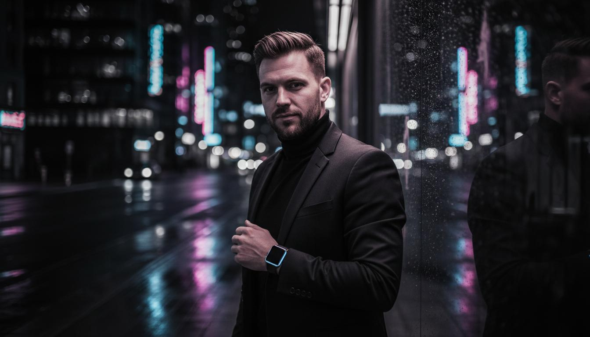

# Gustavo Leimbek Portfolio

[](https://gleimbek.github.io)
[](https://reactjs.org/)
[](https://www.typescriptlang.org/)
[](https://vitejs.dev/)
[](https://tailwindcss.com/)

> A cinematic, immersive portfolio showcasing my work as a Software Web Developer & IT Support Specialist.



## ✨ Features

- **Immersive WebGL Backgrounds** - Dynamic distortion effects that respond to scroll velocity
- **Cinematic Scroll Experience** - GSAP-powered pinned sections with smooth animations
- **Responsive Design** - Fully optimized for desktop, tablet, and mobile devices
- **Modern Tech Stack** - Built with React, TypeScript, Vite, and Tailwind CSS
- **Performance Optimized** - Fast load times and smooth 60fps animations

## 🚀 Live Demo

**[View Live Portfolio →](https://gleimbek.github.io)**

## 🛠️ Tech Stack

- **Framework:** React 18 + TypeScript
- **Build Tool:** Vite
- **Styling:** Tailwind CSS 3.4
- **Animations:** GSAP + ScrollTrigger
- **3D/WebGL:** React Three Fiber + Three.js
- **UI Components:** shadcn/ui

## 📦 Installation

```bash
# Clone the repository
git clone https://github.com/gleimbek/portfolio.git

# Navigate to project folder
cd portfolio

# Install dependencies
npm install

# Start development server
npm run dev

# Build for production
npm run build
```

## 🏗️ Project Structure

```
portfolio/
├── public/              # Static assets (images)
├── src/
│   ├── components/      # Reusable components
│   │   ├── Navigation.tsx
│   │   └── WebGLBackground.tsx
│   ├── sections/        # Page sections
│   │   ├── HeroSection.tsx
│   │   ├── WorkSection.tsx
│   │   ├── CapabilitiesSection.tsx
│   │   ├── ExperienceSection.tsx
│   │   └── ContactSection.tsx
│   ├── App.tsx          # Main app component
│   └── index.css        # Global styles
├── index.html
├── package.json
├── tailwind.config.js
├── tsconfig.json
└── vite.config.ts
```

## 🎨 Design System

### Colors
- **Background Primary:** `#0B0B0D` (near-black)
- **Background Secondary:** `#6B6B70` (gray)
- **Accent:** `#E1062C` (signal red)
- **Text Primary:** `#F4F4F5` (off-white)
- **Text Secondary:** `#A7A7AD` (muted gray)

### Typography
- **Headings:** Sora (700-800)
- **Body:** Inter (400-500)
- **Labels:** IBM Plex Mono (500)

## 📄 License

This project is open source and available under the [MIT License](LICENSE).

## 🤝 Connect

- **Email:** [gleimbek@gmail.com](mailto:gleimbek@gmail.com)
- **LinkedIn:** [linkedin.com/in/gleimbek](https://linkedin.com/in/gleimbek)
- **Location:** Las Vegas, NV

---

Built with ❤️ by Gustavo Leimbek
